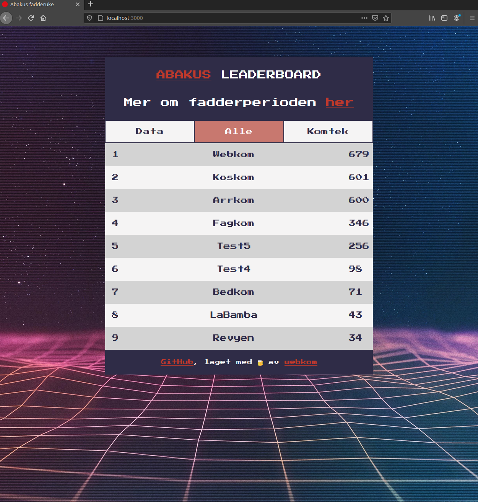

# (WIP) Fadderuke leaderboard

Docs on how to setup backend is located in **go-backend** folder.

This project uses [React](https://github.com/facebook/react) as frontend. The backend is a [Golang](https://golang.org/) [OpenFaaS](https://github.com/openfaas/faas) function that makes a google-sheet document available as a basic json API.

## Screenshot:

## Colors:

Martinique #2F2C47

Contessa #C8786F

Kimberly #7471A7

Neptune #76A6B4

## TODO

- [ ] <s>Add traefik config for proxying backend</s>
- [x] Setup go-function to handle CORS header to allow wildcard: "\*"
- [x] Redo json formatting from backend
- [ ] Add better error handling
- [x] Add better docs.
- [x] Redo desgin
- [ ] Setup CI

## TODO features

- [ ] Click on indvidual groups to see score on different tasks
- [ ] Progressive Web App
