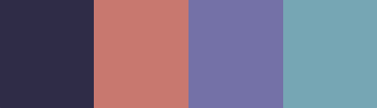

# (WIP) Fadderuke leaderboard

Docs on how to setup backend is located in **go-backend** folder, and frontend is located in **webapp** folder.

This project uses [React](https://github.com/facebook/react) as frontend. The backend is a [Golang](https://golang.org/) [OpenFaaS](https://github.com/openfaas/faas) function that makes a google-sheet document available as a basic json API.

## Screenshots:

## Colors:

Martinique #2F2C47

Contessa #C8786F

Kimberly #7471A7

Neptune #76A6B4
